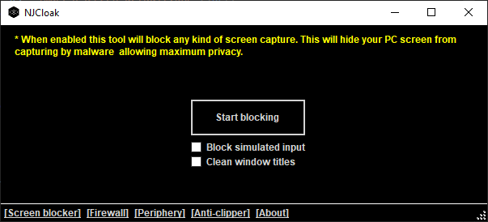
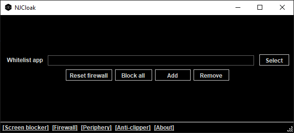
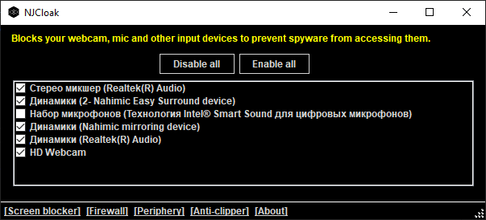
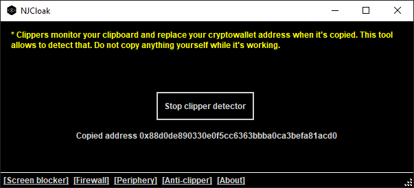

# NJCloak
A tool designed to increase privacy on Windows and counter malware using various techniques.

## Motivation
Most modern antivirus softwares fail against complex malware and can be bypassed with relative ease using payload encryption. Therefore using **any** of them doesn't ensure your safety and privacy. Working in cybersecurity made me a bit paranoid so I created this tool for personal use. It allows to partially counter most average spyware and ensure real privacy.

## Features

### Screen blocker

Blocks your screen from being captured by any programs. From user perspective this is fully invisible and doesn't affect your system usage. Comes with two settings:

- Block simulated inputs - blocks inputs (both mouse & keyboard) injected by software. This prevents malware from remotely controlling your PC.

- Clean window titles - cleans all window titles since they can also contain sensitive information.

     

 

     
    <text>Screen blocker disabled</text>

 

     
    <text>Screen blocker enabled</text>

 

### Firewall

Deny network access for all programs except for whitelisted executables. If you run a malware that requires internet connection it will be completely helpless, since it won't be able to reach remote endpoints.

     

 

### Periphery

Allows to enable & disable your webcam and mic devices quickly.

     

 

### Clipper detector

Helps to detect crypto clippers automatically by copying random wallet addresses and checking if they changed.

     

 

**More features might be added soon, I'm opened to suggestions aswell...**

