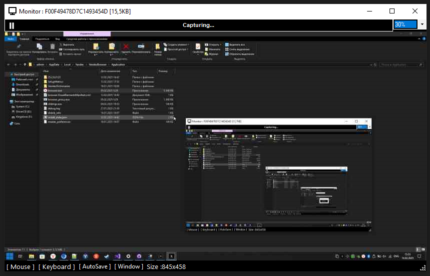
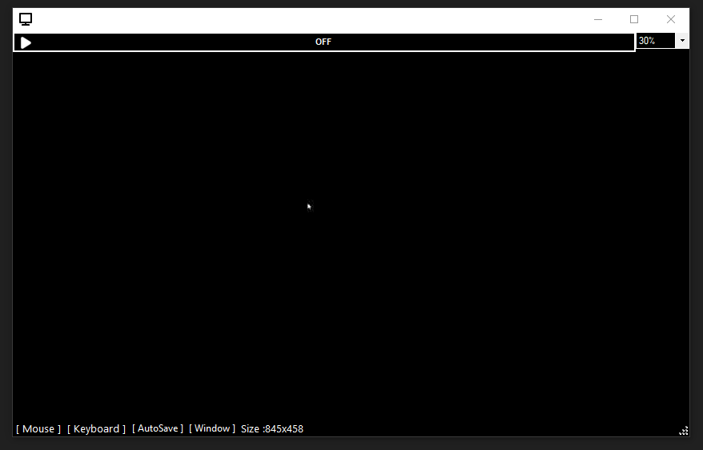
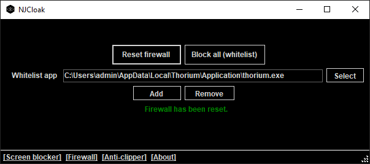
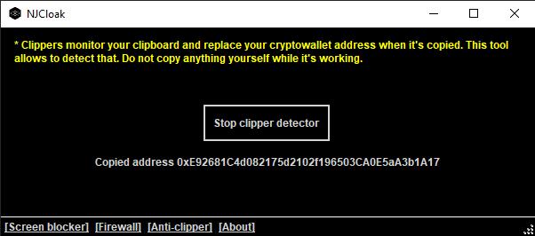

# NJCloak
A tool designed to increase privacy on Windows and counter malware using various techniques.

## Motivation
Most modern antivirus softwares fail against complex malware and can be bypassed with relative ease using payload encryption. Therefore using **any** of them doesn't ensure your safety and privacy. Working in cybersecurity made me a bit paranoid so I created this tool for personal use. It allows to partially counter most average spyware and ensure real privacy.

## Features

#### Screen blocker
Allows to block your screen from capture by any apps. Any remote administration tool will fail to capture and control your screen. Has a feature to clean window titles, since they can contain sensitive information too.

     
    <text>Screen blocker disabled</text>

 

     
    <text>Screen blocker enabled</text>

 

#### Firewall
Deny network access for all software except for whitelisted ones.

     

 

#### Clipper detector
Helps to detect crypto clippers automatically by copying wallet addresses and checking if they changed.

     

 

**More features might be added soon, I'm opened to suggestions aswell...**

